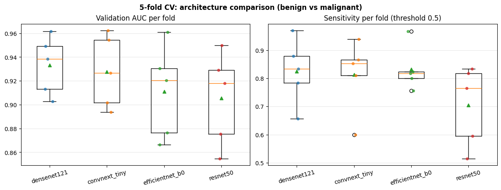
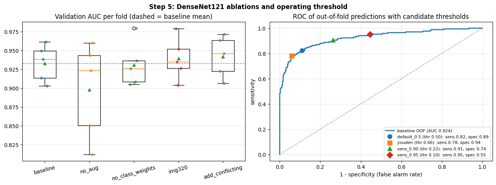
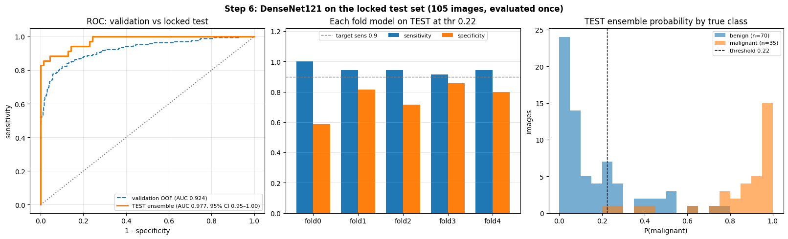

# Breast Ultrasound Classification with CNNs

Leakage-aware deep learning pipeline for benign vs malignant classification of breast ultrasound images (BUSI dataset), with explainability, external validation, and cloud-portable training.

> ⚠️ Research project only — not a diagnostic tool.

## Status
- [x] Step 0 — Project setup
- [x] Step 1 — Data audit & leak-free split
- [x] Step 2 — Dataset & preprocessing
- [x] Step 3 — Baseline CNN
- [x] Step 4 — 5-fold CV & architecture comparison
- [x] Step 5 — Ablations
- [x] Step 6 — Held-out test evaluation
- [ ] Step 7 — Explainability (Grad-CAM vs lesion masks)
- [ ] Step 8 — External validation
- [ ] Step 9 — Cloud training
- [ ] Step 10 — Demo deployment
- [ ] Step 11 — Report & slides

## Dataset
BUSI — Breast Ultrasound Images Dataset (Al-Dhabyani et al., *Data in Brief*, 2020).

## Data audit findings (Step 1)

Before training anything, every BUSI image was fingerprinted with a perceptual hash (pHash, Hamming distance ≤ 4) to find exact and near-duplicate images.

| Finding | Count |
|---|---|
| Total images (benign / malignant / normal) | 780 (437 / 210 / 133) |
| Images with multiple lesion masks | 17 |
| Exact duplicates (MD5) | 1 |
| Near-duplicate pairs | 186 |
| Unique image groups after merging near-duplicates | 627 |
| Near-duplicate pairs with **conflicting labels** | 10 |
| Conflicting-label groups excluded | 8 groups, 18 images (10 benign, 6 malignant, 2 normal) |


**What this means.** About 35% of BUSI images (277 of 780) have at least one near-identical copy, and about 20% (153 images) are redundant copies of another image. If images are split randomly, copies of the same scan can land in both the training and test sets, which inflates reported performance. Ten near-identical pairs even carry different labels (e.g. the same scan labelled once as benign and once as malignant).

**How this project handles it.**
- Near-duplicates are merged into groups, and splits are made at the group level (`StratifiedGroupKFold`), so copies never cross the train/test boundary.
- Groups with conflicting labels are excluded from all experiments, since their true label is unknown (`DROP_CONFLICTING = True`; setting it to `False` enables an ablation).
- Assertions in the split script stop the pipeline if any leakage is detected.

**Final split (762 images):** held-out test set of 122 images (70 / 35 / 17) and 640 images for 5-fold cross-validation.

## Data pipeline (Step 2)

- **Task:** benign vs malignant (normal images excluded, since they contain no lesion to classify). A 3-class option is kept for later.
- **Resizing:** letterbox to 224×224 (aspect ratio kept, padded with black) so lesion shape is not distorted.
- **Input:** grayscale ultrasound repeated to 3 channels, ImageNet normalisation (for pretrained CNNs).
- **Augmentation (training only):** horizontal flip, small rotation/shift/scale (±10°, ±5%, 0.9–1.1), brightness/contrast jitter. No vertical flip, since skin is always at the top of an ultrasound image.
- **Class imbalance:** class-weighted loss (fold 0: benign 0.73, malignant 1.57).

| Split | Benign | Malignant | Total |
|---|---|---|---|
| Held-out test (locked) | 70 | 35 | 105 |
| Each CV fold (train / val) | ~285 / ~71 | ~135 / ~34 | ~420 / ~105 |


## Baseline CNN (Step 3)

ImageNet-pretrained **ResNet50** (23.5M parameters), fine-tuned end-to-end on fold 0 (423 train / 103 val images).
AdamW (lr 1e-4, weight decay 1e-4), cosine schedule, class-weighted cross-entropy, batch 32, mixed precision, early stopping on validation AUC (patience 7).

| Metric (validation, fold 0, threshold 0.5) | Value |
|---|---|
| AUC | 0.929 |
| Sensitivity (malignant detected) | 0.765 (26 / 34) |
| Specificity (benign correctly identified) | 0.928 (64 / 69) |
| Balanced accuracy | 0.846 |
| Best epoch / epochs run | 17 / 24 |


**Observations.** Train and validation loss fall together until epoch 17; after that validation loss rises while training loss keeps falling (overfitting), and early stopping keeps the epoch-17 weights. Sensitivity at the default 0.5 threshold is the weakest metric (8 of 34 malignant cases missed); threshold selection is addressed in later steps. These are single-fold validation numbers used for model selection, so they are optimistic; unbiased performance will come from 5-fold CV and the locked test set.

## 5-fold cross-validation: architecture comparison (Step 4)

Four ImageNet-pretrained CNNs trained with an identical recipe (same folds, augmentation, optimiser, learning rate, seed). Validation metrics at threshold 0.5, mean ± SD over 5 folds; pooled OOF AUC is computed once over all out-of-fold predictions.

| Model | Params | AUC | Sensitivity | Specificity | Pooled OOF AUC |
|---|---|---|---|---|---|
| **DenseNet121** | 7.0M | **0.933 ± 0.025** | 0.825 ± 0.116 | 0.889 ± 0.112 | **0.924** |
| ConvNeXt-Tiny | 27.8M | 0.928 ± 0.031 | 0.814 ± 0.128 | 0.842 ± 0.055 | 0.903 |
| EfficientNet-B0 | 4.0M | 0.911 ± 0.039 | 0.833 ± 0.079 | 0.823 ± 0.050 | 0.905 |
| ResNet50 | 23.5M | 0.905 ± 0.039 | 0.705 ± 0.143 | 0.927 ± 0.031 | 0.902 |



**Observations.**
- DenseNet121 has the highest mean AUC, the highest pooled OOF AUC and the smallest spread, and beats ResNet50 on 4 of 5 folds. The gaps between models (≤0.03 AUC) are, however, smaller than the fold-to-fold variation, so with 5 folds they are suggestive rather than statistically established.
- Fold difficulty dominates model choice: every model scores lowest on folds 3 and 4 (mean AUC 0.88–0.90 vs 0.95 on fold 2).
- Sensitivity at the fixed 0.5 threshold is unstable (SD up to 0.14) and ResNet50 is biased towards predicting benign; the operating threshold therefore needs to be chosen explicitly (Step 5).
- ConvNeXt-Tiny's best epoch was the last or near-last epoch on 2 folds, so it may be under-trained at 30 epochs.
- Best epochs are selected on the same validation fold, so these numbers are optimistic; unbiased performance comes from the locked test set (Step 6).

**Model carried forward: DenseNet121** (best mean and pooled AUC, lowest variance, 7M parameters).

## Ablations and operating threshold (Step 5)

DenseNet121, 5-fold CV. Each experiment changes exactly one thing relative to the baseline (224px, augmentation, class-weighted loss). ΔAUC is the mean paired difference against the baseline on the same folds. The baseline reproduced the Step 4 DenseNet121 fold results exactly, confirming the pipeline is deterministic.

| Experiment | AUC (mean ± SD) | Pooled OOF AUC | ΔAUC vs baseline | Folds better |
|---|---|---|---|---|
| Baseline | 0.933 ± 0.025 | 0.924 | — | — |
| No augmentation | 0.898 ± 0.064 | 0.900 | −0.035 | 1 / 5 |
| No class weights | 0.931 ± 0.030 | 0.925 | −0.002 | 3 / 5 |
| 320×320 input | 0.939 ± 0.028 | 0.933 | +0.006 | 4 / 5 |
| + 18 conflicting-label images in training | 0.942 ± 0.027 | 0.935 | +0.009 | 3 / 5 |

**Findings.**
- **Augmentation clearly matters:** removing it lowers AUC by 0.035, more than doubles fold-to-fold variation, and the model overfits sooner (best epoch ~10 vs ~16).
- **Class weights do not change AUC** (expected: AUC is threshold-free; weighting mainly shifts the operating point).
- **320px input and adding the conflicting-label images** give small gains (+0.006, +0.009) that are within fold-to-fold variation. Adding the 18 conflicting images to *training* did not hurt, so the case for excluding them rests on evaluation validity (their true label is unknown), not on training performance.
- Because choosing the best of several variants on the same validation folds inflates results, the **baseline recipe is kept** for the final model; 320px input is noted as a promising option.

**Operating threshold** (chosen on pooled out-of-fold predictions of the baseline — training/validation data only, test set untouched):

| Rule | Threshold | Sensitivity | Specificity | Missed cancers | False alarms |
|---|---|---|---|---|---|
| Default | 0.500 | 0.822 (139/169) | 0.891 (318/357) | 30 | 39 |
| Youden's J | 0.662 | 0.781 (132/169) | 0.941 (336/357) | 37 | 21 |
| **Sensitivity ≥ 0.90** | **0.225** | **0.905 (153/169)** | **0.737 (263/357)** | **16** | **94** |
| Sensitivity ≥ 0.95 | 0.100 | 0.953 (161/169) | 0.555 (198/357) | 8 | 159 |

The default 0.5 threshold misses 30 of 169 malignant lesions. The **sensitivity ≥ 0.90 rule (threshold 0.225)** is carried forward to the held-out test evaluation: it halves missed cancers (30 → 16) at the cost of more false alarms, a trade-off that suits a screening-support setting. The ≥ 0.95 rule was rejected because specificity collapses to 0.56.

**Caveats.** (1) The sensitivity/specificity values in this table are measured on the same out-of-fold predictions used to choose the thresholds, and each fold's model was early-stopped on its own validation fold, so they are optimistic; the test set gives the unbiased estimate. (2) The threshold was derived from *single-model* predictions, so on the test set it is applied to each of the five fold models individually; an averaged ensemble has a different probability distribution and is reported for AUC (threshold-free) only as a secondary result. (3) The test set holds only 35 malignant cases, so each missed cancer moves test sensitivity by ~3 points; confidence intervals will be reported.



## Locked test set evaluation (Step 6)

The five baseline DenseNet121 fold models were retrained (reproducing the Step 5 validation AUCs exactly), the threshold was frozen from their out-of-fold predictions (sensitivity ≥ 0.90 → **0.225**), and only then was the test set (105 images: 70 benign, 35 malignant) opened — **once**. 95% confidence intervals come from 2,000 bootstrap resamples of whole duplicate groups.

**Primary result — each fold model at the frozen threshold (mean ± SD over 5 models):**

| Metric | Test set | 95% CI |
|---|---|---|
| AUC | **0.961 ± 0.019** | — |
| Sensitivity | **0.949 ± 0.031** | 0.900 – 0.986 |
| Specificity | **0.754 ± 0.108** | 0.665 – 0.835 |
| Missed malignant (of 35) | 1.8 on average (range 0–3) | |
| False alarms (of 70 benign) | 17.2 on average (range 10–29) | |

**Secondary — 5-model ensemble (mean probability):** AUC **0.977** (95% CI 0.947–0.997).

| Model | AUC | Sensitivity | Specificity |
|---|---|---|---|
| fold 0 | 0.930 | 1.000 (35/35) | 0.586 (41/70) |
| fold 1 | 0.969 | 0.943 (33/35) | 0.814 (57/70) |
| fold 2 | 0.958 | 0.943 (33/35) | 0.714 (50/70) |
| fold 3 | 0.976 | 0.914 (32/35) | 0.857 (60/70) |
| fold 4 | 0.975 | 0.943 (33/35) | 0.800 (56/70) |



**Interpretation.**
- The pre-specified target was met: test sensitivity 0.95 (CI lower bound 0.90) at a threshold chosen without seeing the test set.
- Specificity varies widely between fold models (0.59–0.86) at the same threshold: a fixed probability cut-off does not transfer equally across independently trained models, so model calibration is a limitation to address (e.g. temperature scaling).
- Test AUC (0.96) is higher than cross-validation AUC (0.93). This is within the fold-to-fold range seen in CV (0.90–0.96) and the test set is small, so it most likely reflects an easier-than-average split rather than a better model. Duplicate groups were split apart, but near-copies beyond the pHash threshold cannot be fully ruled out; external validation (Step 8) is the stronger test of generalisation.
- 16 test images were misclassified by at least 3 of 5 models (15 benign false alarms, 1 missed malignant); these are examined with Grad-CAM in Step 7.

## Repository structure
```
configs/     experiment configs (YAML)
src/         reusable code (data, models, training, evaluation)
scripts/     entry-point scripts
notebooks/   Kaggle notebooks
results/     figures and tables
```

## Results
_Coming soon._

## Reproducibility
All experiments use fixed seeds and group-aware splits. Code runs unchanged on Kaggle, local machines, and AWS SageMaker.
