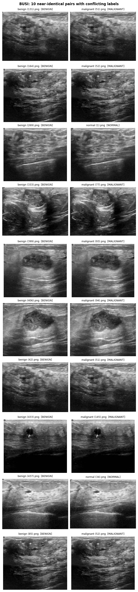
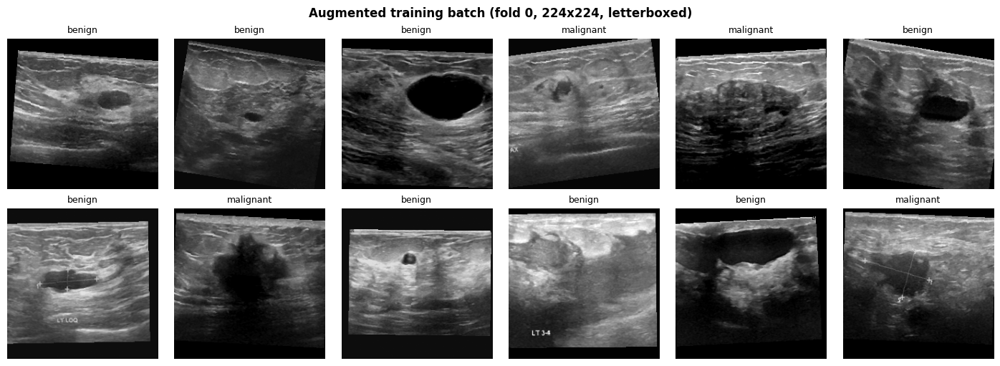
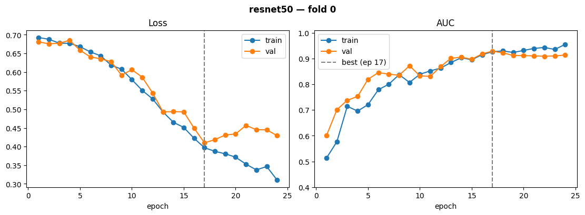

# Breast Ultrasound Classification with CNNs

Leakage-aware deep learning pipeline for benign vs malignant classification of breast ultrasound images (BUSI dataset), with explainability, external validation, and cloud-portable training.

> ⚠️ Research project only — not a diagnostic tool.

## Status
- [x] Step 0 — Project setup
- [x] Step 1 — Data audit & leak-free split
- [x] Step 2 — Dataset & preprocessing
- [x] Step 3 — Baseline CNN
- [ ] Step 4 — 5-fold CV & architecture comparison
- [ ] Step 5 — Ablations
- [ ] Step 6 — Held-out test evaluation
- [ ] Step 7 — Explainability (Grad-CAM vs lesion masks)
- [ ] Step 8 — External validation
- [ ] Step 9 — Cloud training
- [ ] Step 10 — Demo deployment
- [ ] Step 11 — Report & slides

## Dataset
BUSI — Breast Ultrasound Images Dataset (Al-Dhabyani et al., *Data in Brief*, 2020).

## Data audit findings (Step 1)

Before training anything, every BUSI image was fingerprinted with a perceptual hash (pHash, Hamming distance ≤ 4) to find exact and near-duplicate images.

| Finding | Count |
|---|---|
| Total images (benign / malignant / normal) | 780 (437 / 210 / 133) |
| Images with multiple lesion masks | 17 |
| Exact duplicates (MD5) | 1 |
| Near-duplicate pairs | 186 |
| Unique image groups after merging near-duplicates | 627 |
| Near-duplicate pairs with **conflicting labels** | 10 |
| Conflicting-label groups excluded | 8 groups, 18 images (10 benign, 6 malignant, 2 normal) |



**What this means.** About 35% of BUSI images (277 of 780) have at least one near-identical copy, and about 20% (153 images) are redundant copies of another image. If images are split randomly, copies of the same scan can land in both the training and test sets, which inflates reported performance. Ten near-identical pairs even carry different labels (e.g. the same scan labelled once as benign and once as malignant).

**How this project handles it.**
- Near-duplicates are merged into groups, and splits are made at the group level (`StratifiedGroupKFold`), so copies never cross the train/test boundary.
- Groups with conflicting labels are excluded from all experiments, since their true label is unknown (`DROP_CONFLICTING = True`; setting it to `False` enables an ablation).
- Assertions in the split script stop the pipeline if any leakage is detected.

**Final split (762 images):** held-out test set of 122 images (70 / 35 / 17) and 640 images for 5-fold cross-validation.

## Data pipeline (Step 2)

- **Task:** benign vs malignant (normal images excluded, since they contain no lesion to classify). A 3-class option is kept for later.
- **Resizing:** letterbox to 224×224 (aspect ratio kept, padded with black) so lesion shape is not distorted.
- **Input:** grayscale ultrasound repeated to 3 channels, ImageNet normalisation (for pretrained CNNs).
- **Augmentation (training only):** horizontal flip, small rotation/shift/scale (±10°, ±5%, 0.9–1.1), brightness/contrast jitter. No vertical flip, since skin is always at the top of an ultrasound image.
- **Class imbalance:** class-weighted loss (fold 0: benign 0.73, malignant 1.57).

| Split | Benign | Malignant | Total |
|---|---|---|---|
| Held-out test (locked) | 70 | 35 | 105 |
| Each CV fold (train / val) | ~285 / ~71 | ~135 / ~34 | ~420 / ~105 |



## Baseline CNN (Step 3)

ImageNet-pretrained **ResNet50** (23.5M parameters), fine-tuned end-to-end on fold 0 (423 train / 103 val images).
AdamW (lr 1e-4, weight decay 1e-4), cosine schedule, class-weighted cross-entropy, batch 32, mixed precision, early stopping on validation AUC (patience 7).

| Metric (validation, fold 0, threshold 0.5) | Value |
|---|---|
| AUC | 0.929 |
| Sensitivity (malignant detected) | 0.765 (26 / 34) |
| Specificity (benign correctly identified) | 0.928 (64 / 69) |
| Balanced accuracy | 0.846 |
| Best epoch / epochs run | 17 / 24 |



**Observations.** Train and validation loss fall together until epoch 17; after that validation loss rises while training loss keeps falling (overfitting), and early stopping keeps the epoch-17 weights. Sensitivity at the default 0.5 threshold is the weakest metric (8 of 34 malignant cases missed); threshold selection is addressed in later steps. These are single-fold validation numbers used for model selection, so they are optimistic; unbiased performance will come from 5-fold CV and the locked test set.

## Repository structure
```
configs/     experiment configs (YAML)
src/         reusable code (data, models, training, evaluation)
scripts/     entry-point scripts
notebooks/   Kaggle notebooks
results/     figures and tables
```

## Results
_Coming soon._

## Reproducibility
All experiments use fixed seeds and group-aware splits. Code runs unchanged on Kaggle, local machines, and AWS SageMaker.
