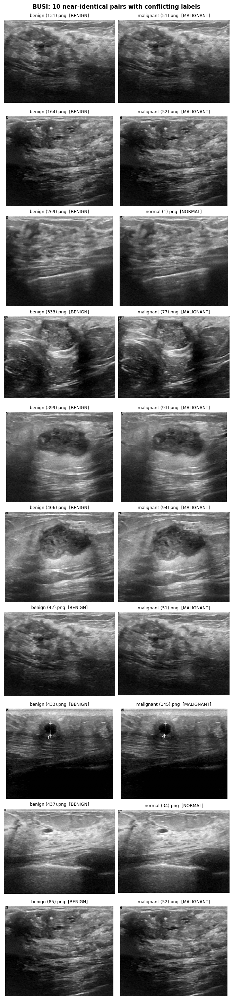
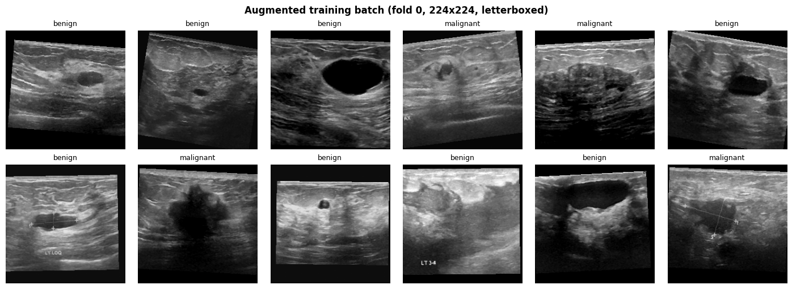
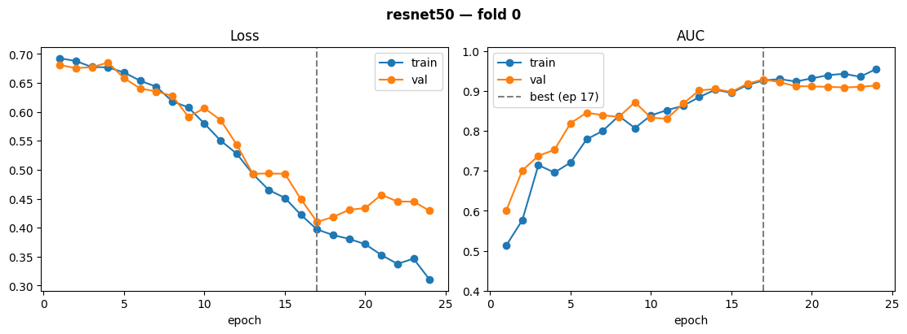
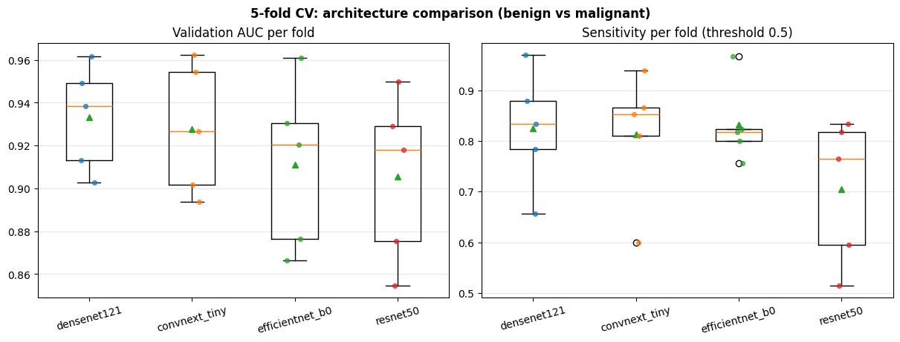
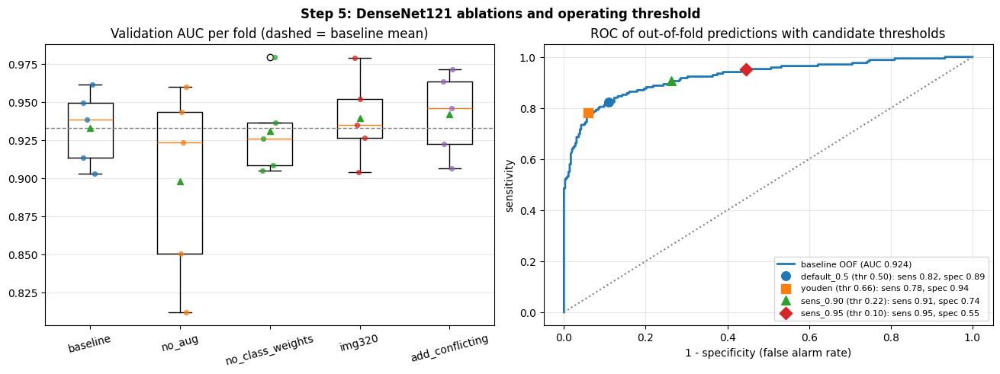
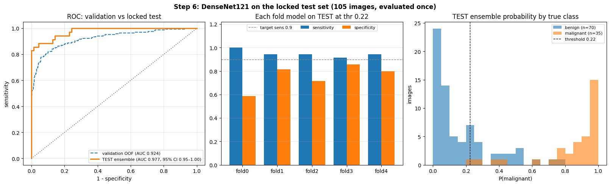
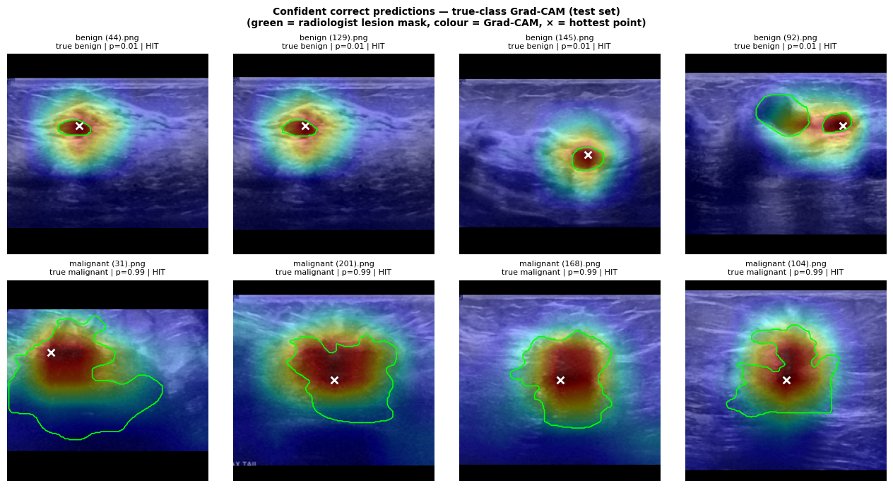
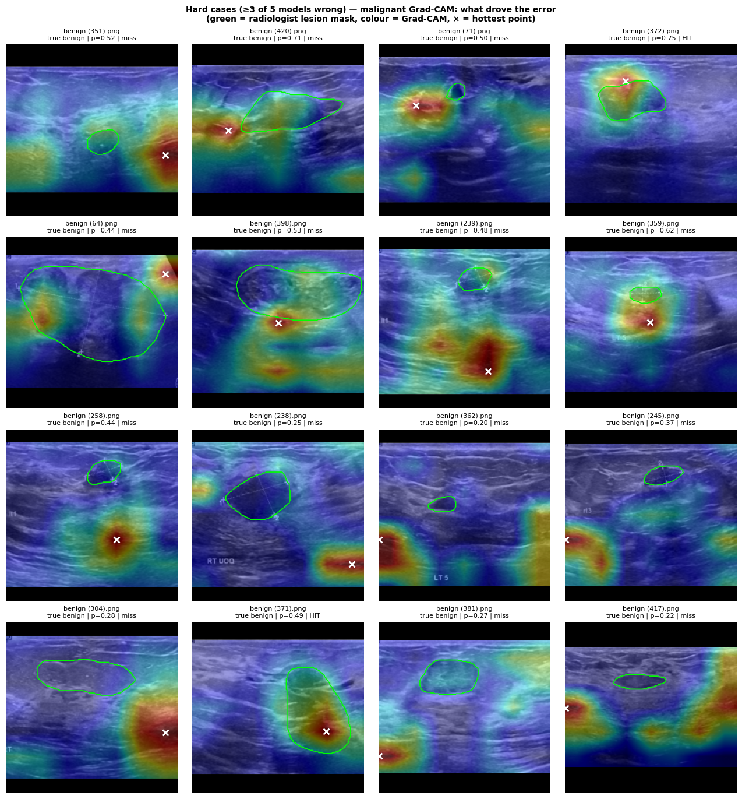
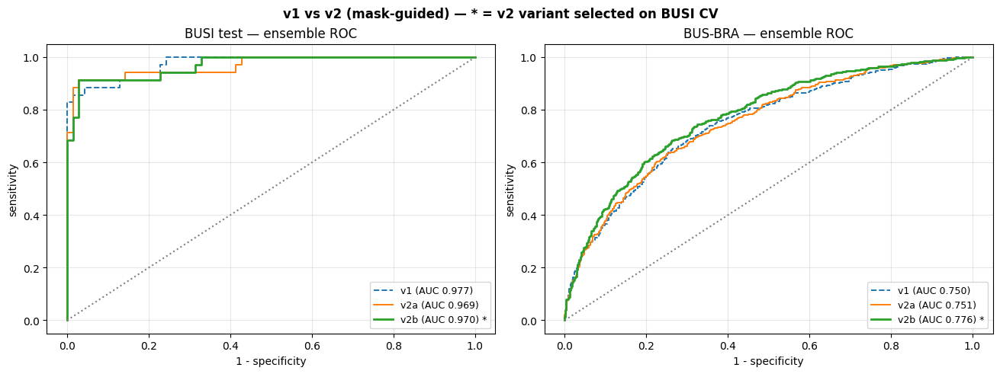

# Breast Ultrasound Classification with CNNs

Leakage-aware deep learning pipeline for benign vs malignant classification of breast ultrasound images (BUSI dataset), with explainability, external validation, and cloud GPU training on Kaggle.

> ⚠️ Research project only — not a diagnostic tool.

**Key results**
- BUSI locked test (internal): ensemble AUC **0.977** — same hospital as training.
- BUS-BRA (external, different country and scanners): AUC falls to **0.750** — single-centre results do not transfer.
- v2 (mask-guided + aspect-crop, pre-registered): external AUC **0.776**, **+0.027** over v1 (95% CI +0.010 to +0.044).
- Live demo: [Hugging Face Space](https://huggingface.co/spaces/Wajiddev99/breast-ultrasound-classifier) · Weights: [busi-densenet121-v2b](https://huggingface.co/Wajiddev99/busi-densenet121-v2b)

## Status
- [x] Step 0 — Project setup
- [x] Step 1 — Data audit & leak-free split
- [x] Step 2 — Dataset & preprocessing
- [x] Step 3 — Baseline CNN
- [x] Step 4 — 5-fold CV & architecture comparison
- [x] Step 5 — Ablations
- [x] Step 6 — Held-out test evaluation
- [x] Step 7 — Explainability (Grad-CAM vs lesion masks)
- [x] Step 8 — External validation
- [x] Step 9 — Cloud training: all experiments run on Kaggle cloud GPUs (NVIDIA T4)
- [x] Step 10 — Demo deployment
- [ ] Step 11 — Report & slides

## Dataset
BUSI — Breast Ultrasound Images Dataset (Al-Dhabyani et al., *Data in Brief*, 2020). Used for training, cross-validation and the internal test.

BUS-BRA — Breast Ultrasound Dataset from Brazil (Gómez-Flores et al., *Medical Physics*, 2024). Used only for external validation (Step 8).

## Data audit findings (Step 1)

Before training anything, every BUSI image was fingerprinted with a perceptual hash (pHash, Hamming distance ≤ 4) to find exact and near-duplicate images.

| Finding | Count |
|---|---|
| Total images (benign / malignant / normal) | 780 (437 / 210 / 133) |
| Images with multiple lesion masks | 17 |
| Exact duplicates (MD5) | 1 |
| Near-duplicate pairs | 186 |
| Unique image groups after merging near-duplicates | 627 |
| Near-duplicate pairs with **conflicting labels** | 10 |
| Conflicting-label groups excluded | 8 groups, 18 images (10 benign, 6 malignant, 2 normal) |



**What this means.** About 35% of BUSI images (277 of 780) have at least one near-identical copy, and about 20% (153 images) are redundant copies of another image. If images are split randomly, copies of the same scan can land in both the training and test sets, which inflates reported performance. Ten near-identical pairs even carry different labels (e.g. the same scan labelled once as benign and once as malignant).

**How this project handles it.**
- Near-duplicates are merged into groups, and splits are made at the group level (`StratifiedGroupKFold`), so copies never cross the train/test boundary.
- Groups with conflicting labels are excluded from all experiments, since their true label is unknown (`DROP_CONFLICTING = True`; setting it to `False` enables an ablation).
- Assertions in the split script stop the pipeline if any leakage is detected.

**Final split (762 images):** held-out test set of 122 images (70 / 35 / 17) and 640 images for 5-fold cross-validation.

## Data pipeline (Step 2)

- **Task:** benign vs malignant (normal images excluded, since they contain no lesion to classify). A 3-class option is kept for later.
- **Resizing:** letterbox to 224×224 (aspect ratio kept, padded with black) so lesion shape is not distorted.
- **Input:** grayscale ultrasound repeated to 3 channels, ImageNet normalisation (for pretrained CNNs).
- **Augmentation (training only):** horizontal flip, small rotation/shift/scale (±10°, ±5%, 0.9–1.1), brightness/contrast jitter. No vertical flip, since skin is always at the top of an ultrasound image.
- **Class imbalance:** class-weighted loss (fold 0: benign 0.73, malignant 1.57).

| Split | Benign | Malignant | Total |
|---|---|---|---|
| Held-out test (locked) | 70 | 35 | 105 |
| Each CV fold (train / val) | ~285 / ~71 | ~135 / ~34 | ~420 / ~105 |



## Baseline CNN (Step 3)

ImageNet-pretrained **ResNet50** (23.5M parameters), fine-tuned end-to-end on fold 0 (423 train / 103 val images).
AdamW (lr 1e-4, weight decay 1e-4), cosine schedule, class-weighted cross-entropy, batch 32, mixed precision, early stopping on validation AUC (patience 7).

| Metric (validation, fold 0, threshold 0.5) | Value |
|---|---|
| AUC | 0.929 |
| Sensitivity (malignant detected) | 0.765 (26 / 34) |
| Specificity (benign correctly identified) | 0.928 (64 / 69) |
| Balanced accuracy | 0.846 |
| Best epoch / epochs run | 17 / 24 |



**Observations.** Train and validation loss fall together until epoch 17; after that validation loss rises while training loss keeps falling (overfitting), and early stopping keeps the epoch-17 weights. Sensitivity at the default 0.5 threshold is the weakest metric (8 of 34 malignant cases missed); threshold selection is addressed in later steps. These are single-fold validation numbers used for model selection, so they are optimistic; unbiased performance will come from 5-fold CV and the locked test set.

## 5-fold cross-validation: architecture comparison (Step 4)

Four ImageNet-pretrained CNNs trained with an identical recipe (same folds, augmentation, optimiser, learning rate, seed). Validation metrics at threshold 0.5, mean ± SD over 5 folds; pooled OOF AUC is computed once over all out-of-fold predictions.

| Model | Params | AUC | Sensitivity | Specificity | Pooled OOF AUC |
|---|---|---|---|---|---|
| **DenseNet121** | 7.0M | **0.933 ± 0.025** | 0.825 ± 0.116 | 0.889 ± 0.112 | **0.924** |
| ConvNeXt-Tiny | 27.8M | 0.928 ± 0.031 | 0.814 ± 0.128 | 0.842 ± 0.055 | 0.903 |
| EfficientNet-B0 | 4.0M | 0.911 ± 0.039 | 0.833 ± 0.079 | 0.823 ± 0.050 | 0.905 |
| ResNet50 | 23.5M | 0.905 ± 0.039 | 0.705 ± 0.143 | 0.927 ± 0.031 | 0.902 |



**Observations.**
- DenseNet121 has the highest mean AUC, the highest pooled OOF AUC and the smallest spread, and beats ResNet50 on 4 of 5 folds. The gaps between models (≤0.03 AUC) are, however, smaller than the fold-to-fold variation, so with 5 folds they are suggestive rather than statistically established.
- Fold difficulty dominates model choice: every model scores lowest on folds 3 and 4 (mean AUC 0.88–0.90 vs 0.95 on fold 2).
- Sensitivity at the fixed 0.5 threshold is unstable (SD up to 0.14) and ResNet50 is biased towards predicting benign; the operating threshold therefore needs to be chosen explicitly (Step 5).
- ConvNeXt-Tiny's best epoch was the last or near-last epoch on 2 folds, so it may be under-trained at 30 epochs.
- Best epochs are selected on the same validation fold, so these numbers are optimistic; unbiased performance comes from the locked test set (Step 6).

**Model carried forward: DenseNet121** (best mean and pooled AUC, lowest variance, 7M parameters).

## Ablations and operating threshold (Step 5)

DenseNet121, 5-fold CV. Each experiment changes exactly one thing relative to the baseline (224px, augmentation, class-weighted loss). ΔAUC is the mean paired difference against the baseline on the same folds. The baseline reproduced the Step 4 DenseNet121 fold results exactly, confirming the pipeline is deterministic.

| Experiment | AUC (mean ± SD) | Pooled OOF AUC | ΔAUC vs baseline | Folds better |
|---|---|---|---|---|
| Baseline | 0.933 ± 0.025 | 0.924 | — | — |
| No augmentation | 0.898 ± 0.064 | 0.900 | −0.035 | 1 / 5 |
| No class weights | 0.931 ± 0.030 | 0.925 | −0.002 | 3 / 5 |
| 320×320 input | 0.939 ± 0.028 | 0.933 | +0.006 | 4 / 5 |
| + 18 conflicting-label images in training | 0.942 ± 0.027 | 0.935 | +0.009 | 3 / 5 |

**Findings.**
- **Augmentation clearly matters:** removing it lowers AUC by 0.035, more than doubles fold-to-fold variation, and the model overfits sooner (best epoch ~10 vs ~16).
- **Class weights do not change AUC** (expected: AUC is threshold-free; weighting mainly shifts the operating point).
- **320px input and adding the conflicting-label images** give small gains (+0.006, +0.009) that are within fold-to-fold variation. Adding the 18 conflicting images to *training* did not hurt, so the case for excluding them rests on evaluation validity (their true label is unknown), not on training performance.
- Because choosing the best of several variants on the same validation folds inflates results, the **baseline recipe is kept** for the final model; 320px input is noted as a promising option.

**Operating threshold** (chosen on pooled out-of-fold predictions of the baseline — training/validation data only, test set untouched):

| Rule | Threshold | Sensitivity | Specificity | Missed cancers | False alarms |
|---|---|---|---|---|---|
| Default | 0.500 | 0.822 (139/169) | 0.891 (318/357) | 30 | 39 |
| Youden's J | 0.662 | 0.781 (132/169) | 0.941 (336/357) | 37 | 21 |
| **Sensitivity ≥ 0.90** | **0.225** | **0.905 (153/169)** | **0.737 (263/357)** | **16** | **94** |
| Sensitivity ≥ 0.95 | 0.100 | 0.953 (161/169) | 0.555 (198/357) | 8 | 159 |

The default 0.5 threshold misses 30 of 169 malignant lesions. The **sensitivity ≥ 0.90 rule (threshold 0.225)** is carried forward to the held-out test evaluation: it halves missed cancers (30 → 16) at the cost of more false alarms, a trade-off that suits a screening-support setting. The ≥ 0.95 rule was rejected because specificity collapses to 0.56.

**Caveats.** (1) The sensitivity/specificity values in this table are measured on the same out-of-fold predictions used to choose the thresholds, and each fold's model was early-stopped on its own validation fold, so they are optimistic; the test set gives the unbiased estimate. (2) The threshold was derived from *single-model* predictions, so on the test set it is applied to each of the five fold models individually; an averaged ensemble has a different probability distribution and is reported for AUC (threshold-free) only as a secondary result. (3) The test set holds only 35 malignant cases, so each missed cancer moves test sensitivity by ~3 points; confidence intervals will be reported.



## Locked test set evaluation (Step 6)

The five baseline DenseNet121 fold models were retrained (reproducing the Step 5 validation AUCs exactly), the threshold was frozen from their out-of-fold predictions (sensitivity ≥ 0.90 → **0.225**), and only then was the test set (105 images: 70 benign, 35 malignant) opened — **once**. 95% confidence intervals come from 2,000 bootstrap resamples of whole duplicate groups.

**Primary result — each fold model at the frozen threshold (mean ± SD over 5 models):**

| Metric | Test set | 95% CI |
|---|---|---|
| AUC | **0.961 ± 0.019** | — |
| Sensitivity | **0.949 ± 0.031** | 0.900 – 0.986 |
| Specificity | **0.754 ± 0.108** | 0.665 – 0.835 |
| Missed malignant (of 35) | 1.8 on average (range 0–3) | |
| False alarms (of 70 benign) | 17.2 on average (range 10–29) | |

**Secondary — 5-model ensemble (mean probability):** AUC **0.977** (95% CI 0.947–0.997).

| Model | AUC | Sensitivity | Specificity |
|---|---|---|---|
| fold 0 | 0.930 | 1.000 (35/35) | 0.586 (41/70) |
| fold 1 | 0.969 | 0.943 (33/35) | 0.814 (57/70) |
| fold 2 | 0.958 | 0.943 (33/35) | 0.714 (50/70) |
| fold 3 | 0.976 | 0.914 (32/35) | 0.857 (60/70) |
| fold 4 | 0.975 | 0.943 (33/35) | 0.800 (56/70) |



**Interpretation.**
- The pre-specified target was met: test sensitivity 0.95 (CI lower bound 0.90) at a threshold chosen without seeing the test set.
- Specificity varies widely between fold models (0.59–0.86) at the same threshold: a fixed probability cut-off does not transfer equally across independently trained models, so model calibration is a limitation to address (e.g. temperature scaling).
- Test AUC (0.96) is higher than cross-validation AUC (0.93). This is within the fold-to-fold range seen in CV (0.90–0.96) and the test set is small, so it most likely reflects an easier-than-average split rather than a better model. Duplicate groups were split apart, but near-copies beyond the pHash threshold cannot be fully ruled out; external validation (Step 8) is the stronger test of generalisation.
- 16 test images were misclassified by at least 3 of 5 models (15 benign false alarms, 1 missed malignant); these are examined with Grad-CAM in Step 7.

## Explainability: Grad-CAM vs lesion masks (Step 7)

Grad-CAM heatmaps (last DenseNet block, averaged over the 5 fold models) were computed on the 105 test images and compared with the radiologists' lesion masks. Two targets answer two different questions:
- **True-class CAM** — which regions support the correct answer? (tests whether the model uses the lesion)
- **Malignant CAM** — which regions push the score towards malignant? (explains false alarms)

*Pointing hit* = the hottest pixel lies inside the lesion (±7 px); *chance* = hit rate of a random point; *ratio* = share of heatmap energy inside the lesion ÷ lesion's share of the image (1 = chance).

| True-class CAM | n | Pointing hit | Chance | Energy ratio |
|---|---|---|---|---|
| All test images | 105 | **0.77** | 0.14 | **2.70** |
| Benign | 70 | 0.76 | 0.10 | 3.04 |
| Malignant | 35 | 0.80 | 0.20 | 2.17 |
| Correctly classified | 88 | 0.82 | 0.14 | 2.74 |
| Hard cases (≥3 of 5 models wrong) | 17 | 0.53 | 0.13 | 1.91 |

| Malignant CAM on hard cases | n | Pointing hit | Chance | Energy ratio |
|---|---|---|---|---|
| Hard cases (≥3 of 5 models wrong) | 17 | 0.12 | 0.13 | 1.01 |




**Findings.**
- **The model localises the lesion.** For correct predictions the hottest point falls on the lesion 82% of the time (chance 14%), for both benign and malignant cases, with 2–3× more heatmap energy on the lesion than expected by chance.
- **False alarms are driven by regions outside the lesion.** On the benign images called malignant, the malignant evidence lands on the lesion no more often than chance (0.12 vs 0.13). Visually, the heat sits either **directly below the lesion** — where posterior acoustic shadowing, a genuine sonographic sign of malignancy, appears — or at **image borders** with no anatomical meaning.
- **No sign of a text-annotation shortcut** in the inspected cases: burned-in labels (e.g. "RT UOQ", "LT 5") were not highlighted.
- An earlier version used the malignant CAM for all images; this made benign images look unlocalised (hit rate 0.06) because a benign lesion is evidence *against* malignancy. Switching to true-class CAM resolved this — reported here as a methodological note.

**Limitations.** Grad-CAM is coarse (7×7 feature map upsampled to 224×224) and shows correlation, not causation; the hard-case group is small (17); caliper marks were assessed only visually. The hard-case count is 17 here versus 16 in Step 6 because Grad-CAM runs in full precision while Step 6 used mixed precision, which moved one borderline probability across the 0.225 threshold.

## External validation on BUS-BRA (Step 8)

The five BUSI-trained DenseNet121 models and the BUSI-frozen threshold (0.225) were applied **unchanged** to **BUS-BRA** (Gómez-Flores et al., *Medical Physics* 2024): 1,875 images from 1,064 patients in Brazil, biopsy-proven, three ultrasound scanners. Nothing was retrained or re-tuned. CIs use a patient-level bootstrap.

| | BUSI internal test (Step 6) | **BUS-BRA external** |
|---|---|---|
| Images (benign / malignant) | 105 (70 / 35) | 1,875 (1,268 / 607) |
| AUC, mean of 5 models | 0.961 ± 0.019 | **0.718 ± 0.022** |
| Ensemble AUC (95% CI) | 0.977 (0.947–0.997) | **0.750 (0.721–0.776)** |
| Sensitivity @ 0.225 | 0.949 ± 0.031 | 0.829 ± 0.107 (CI 0.80–0.85) |
| Specificity @ 0.225 | 0.754 ± 0.108 | 0.420 ± 0.201 (CI 0.40–0.44) |

| Scanner | Images | Malignant | Ensemble AUC |
|---|---|---|---|
| GE Logiq 5 | 809 | 243 | 0.725 |
| GE Logiq 7 | 902 | 285 | 0.772 |
| Toshiba Aplio 300 | 139 | 68 | 0.789 |


**Findings.**
- **Performance drops substantially under domain shift:** AUC falls from 0.96–0.98 on the internal test set to 0.72–0.75 on an independent hospital. This is the most important result of the project: internal test performance on BUSI does not transfer.
- **The loss is in discrimination, not threshold placement.** A post-hoc threshold tuned *on* BUS-BRA for 90% sensitivity lands at 0.223 — almost identical to the BUSI threshold — yet gives specificity of only 0.34. The model's ranking of benign vs malignant is weaker, so no threshold can recover the internal performance.
- **The drop is consistent across scanners** (AUC 0.73–0.79), so it is not caused by one device.
- **Model-to-model instability grows:** at the same threshold, specificity ranges from 0.16 to 0.63 across the five fold models (0.59–0.86 on BUSI).

**Likely contributors** (not individually tested): different image framing — BUS-BRA images are mostly tall, narrow crops while BUSI images are wide, so after letterboxing the tissue occupies a different part of the input; different scanners and acquisition settings; a harder benign class in BUS-BRA (biopsied, BI-RADS 4 lesions that looked suspicious enough to sample); BUSI's single-centre training data (~420 images per fold); and residual optimism in the BUSI test estimate from same-centre similarity between scans.

**Implications.** Single-centre BUSI results — including the ~99% accuracies often reported on this dataset — should not be read as clinical performance. Lesion-focused training was tested next (see v2 below); multi-centre training and domain adaptation remain future work.

## v2: mask-guided training (pre-registered follow-up)

Motivated by Steps 7–8, two variants were specified in [`docs/v2_preregistration.md`](docs/v2_preregistration.md) and committed **before** any v2 training:
- **v2a** — DenseNet121 + auxiliary lesion-mask head (1×1 conv on the 7×7 feature map, BCE loss, λ = 0.5)
- **v2b** — v2a + aspect-ratio crop augmentation (random 50–100% width, 80–100% height, lesion always kept)

Selection used BUSI cross-validation only; each variant's threshold was frozen from its own OOF predictions (sensitivity ≥ 0.90); BUSI test and BUS-BRA were each evaluated once.

| | v1 (baseline) | v2a | **v2b (selected)** |
|---|---|---|---|
| BUSI CV pooled OOF AUC | 0.924 | 0.923 | **0.940** |
| BUSI test ensemble AUC | 0.977 | 0.969 | 0.970 |
| **BUS-BRA ensemble AUC (95% CI)** | 0.750 (0.721–0.776) | 0.751 (0.722–0.779) | **0.776 (0.749–0.804)** |
| BUS-BRA single-model AUC | 0.718 ± 0.022 | 0.721 ± 0.025 | 0.748 ± 0.014 |
| BUS-BRA sensitivity / specificity @ own threshold | 0.83 / 0.42 | 0.82 / 0.39 | 0.70 / 0.65 |
| BUS-BRA specificity range across 5 models | 0.16–0.63 | 0.13–0.68 | 0.42–0.82 |

**Paired ΔAUC vs v1 (ensemble, bootstrap 95% CI):**

| Comparison | BUS-BRA (by patient) | BUSI test (by duplicate group) |
|---|---|---|
| v2a − v1 | +0.002 (−0.016 to +0.018) | −0.009 (−0.032 to +0.009) |
| **v2b − v1** | **+0.027 (+0.010 to +0.044)** ← primary | −0.007 (−0.027 to +0.009) |



**Findings.**
- The pre-registered primary test is met: **v2b improves external AUC by 0.027** (CI excludes 0) without hurting internal test performance, and the five fold models become more consistent (single-model AUC SD 0.014 vs 0.022; specificity range 0.42–0.82 vs 0.16–0.63).
- **The mask loss alone (v2a) did not help** on either dataset. The gain appears only when aspect-ratio crop augmentation is added, so it is most likely driven by robustness to image framing. An aspect-only variant was not pre-registered, so the two effects cannot be fully separated here.
- **The improvement is modest.** External AUC (0.78) remains far below internal AUC (0.97): v2 narrows the domain gap only slightly.
- **The sensitivity target does not transfer.** At its BUSI-derived threshold, v2b reaches 0.70 sensitivity on BUS-BRA (target 0.90), trading sensitivity for specificity compared with v1. Any real deployment would need site-specific calibration.

**Disclosure.** The aspect-crop idea was inspired by seeing BUS-BRA's image framing in Step 8. BUS-BRA was not used to tune any setting and was evaluated once, but because the design was informed by this domain, the gain may be smaller on other unseen hospitals. v2b fold 3 reached its best epoch at 29/30, so the 30-epoch budget may be slightly short.

## Live demo (Step 10)

- **Web app:** [huggingface.co/spaces/Wajiddev99/breast-ultrasound-classifier](https://huggingface.co/spaces/Wajiddev99/breast-ultrasound-classifier) — upload a breast ultrasound image; the five v2b models vote benign/malignant and a Grad-CAM heatmap shows the supporting regions.
- **Model weights:** [huggingface.co/Wajiddev99/busi-densenet121-v2b](https://huggingface.co/Wajiddev99/busi-densenet121-v2b) — 5 fold models, config (threshold 0.335) and model card.
- The demo applies exactly the evaluated decision rule: each fold model votes at its frozen threshold and the label is the majority of five votes. Preprocessing is identical to training.
- ⚠️ Research demo only, not a medical device. Performance drops on images from other hospitals (Step 8).
- The uploaded weights are a rebuild of the evaluated v2b models (four folds reproduce the original validation AUC exactly; fold 4 differs by 0.002).

## Repository structure
```
configs/     experiment configs (YAML)
src/         reusable code (data, models, training, evaluation)
scripts/     entry-point scripts (one per step)
docs/        v2 pre-registration
demo/        Gradio app for the Hugging Face Space
results/     figures and tables
```

## Reproducibility
All experiments use fixed seeds and group-aware splits. The five fold models reproduced identical validation AUCs across three independent runs (Steps 4, 5 and 6). Dataset paths are detected automatically, so the code is not tied to a single environment.
